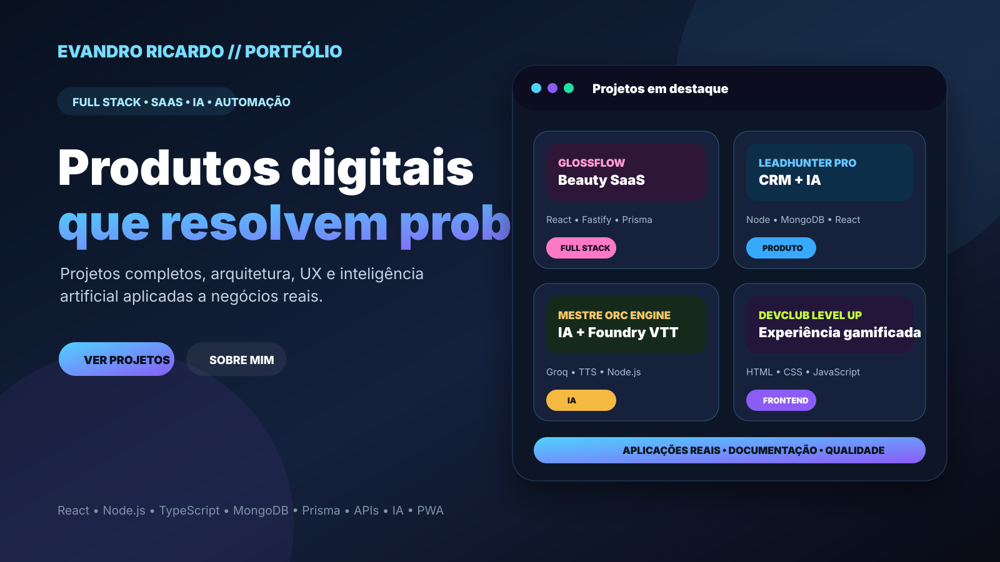

# Portfólio Profissional — Evandro Ricardo de Souza

Portfólio pessoal voltado para empregabilidade, apresentação profissional e demonstração de projetos Full Stack, SaaS, inteligência artificial, automação, dashboards e aplicações web.

## Preview



## Objetivo do projeto

Este repositório funciona como a porta de entrada para apresentar minha trajetória, competências técnicas e principais projetos desenvolvidos.

O foco é demonstrar capacidade de construir aplicações completas, com atenção a:

- Front-end moderno e responsivo.
- Back-end, APIs e regras de negócio.
- Experiência do usuário.
- Organização visual e arquitetura de código.
- Projetos com propósito de negócio.
- Inteligência artificial e automações.
- Estudos de caso técnicos.
- Apresentação clara para recrutadores e clientes.

## Projetos principais destacados

| Projeto | Tipo | Destaque técnico |
|---|---|---|
| GlossFlow | SaaS para salões de beleza | React, Node.js, Fastify, TypeScript, Prisma, MongoDB, CRM, agenda e multiempresa |
| LeadHunter Pro | SaaS de prospecção comercial | Express, MongoDB, JWT, CRM, planos, pagamentos e painel admin |
| Mestre Orc Engine — Fênix | IA integrada ao Foundry VTT | Node.js, Groq, Foundry VTT 13, contexto, segurança, chat, TTS e testes automatizados |
| SaaS Mestre Orc | Plataforma para RPG | Dashboard, campanhas, reservas, conteúdos, marketplace e exportações |
| DevClub Level Up | Experiência institucional gamificada | HTML, CSS, JavaScript modular, GitHub Actions e GitHub Pages |
| Papel de Parede | Landing page comercial | React, UX/UI, catálogo, WhatsApp CTA e responsividade |
| FinançasPro BI | Dashboard financeiro/PWA | JavaScript, PWA, formulários, métricas e fluxo financeiro |

## Sincronização automática com o GitHub

Além dos estudos de caso selecionados manualmente, o site possui uma vitrine dinâmica que consulta os repositórios públicos da conta `turlang`.

Para fazer um novo repositório aparecer automaticamente:

1. deixe o repositório público;
2. adicione uma descrição clara;
3. adicione o tópico `portfolio` nas configurações do repositório;
4. preencha o campo **Website** quando houver uma demonstração online.

A sincronização:

- ignora forks e repositórios arquivados;
- mostra até 12 projetos marcados com `portfolio`;
- ordena os projetos pela atualização mais recente;
- utiliza cache local por uma hora;
- oferece o botão **Atualizar agora**;
- mantém os estudos de caso fixos caso a API do GitHub esteja indisponível;
- não utiliza nem expõe token de acesso no navegador.

## Stack principal

- HTML5
- CSS3
- JavaScript
- React
- Vite
- Node.js
- Express
- Fastify
- TypeScript
- Prisma
- MongoDB
- Mongoose
- JWT
- APIs REST
- Groq e integrações com IA
- TTS e automações
- Foundry VTT
- PWA
- GitHub REST API
- GitHub Pages e GitHub Actions
- Render
- Vercel

## Estrutura

```text
index.html
sobre.html
projetos.html
assets/css/styles.css
assets/css/github-projects.css
assets/js/main.js
docs/AUDITORIA_GITHUB_EMPREGABILIDADE_2026.md
```

## Auditoria de empregabilidade

A organização dos repositórios foi registrada no documento:

```text
docs/AUDITORIA_GITHUB_EMPREGABILIDADE_2026.md
```

Esse arquivo contém:

- ranking dos projetos por empregabilidade;
- projetos principais da vitrine;
- projetos secundários;
- projetos que podem ser arquivados;
- plano de execução para melhorar o GitHub;
- posicionamento profissional sugerido.

## Como testar localmente

Como a seção automática consulta uma API externa, execute o site por um servidor local em vez de abrir o HTML diretamente:

```bash
npx serve .
```

Depois, abra o endereço exibido no terminal.

## Posicionamento profissional

Desenvolvedor Full Stack com foco em aplicações SaaS, React, Node.js, TypeScript, APIs REST, MongoDB, Prisma, dashboards administrativos, automações e soluções com inteligência artificial voltadas a problemas reais.

## Próximas melhorias

- Adicionar screenshots próprios para todos os projetos.
- Incluir links de demonstração online para os projetos que ainda não possuem deploy público.
- Criar estudos de caso completos para GlossFlow, LeadHunter Pro e Mestre Orc Engine.
- Adicionar métricas, desafios técnicos e resultados alcançados em cada case.
